# Multiagente — Automatización de Operaciones

Aplicación de escritorio para automatizar las operaciones logísticas de un agente de cargas: descarga de correos, impresión documental, OCR de tickets de balanza, control de datos contra planillas Excel, despacho de correos y backup.

Construida en Python con **CustomTkinter**, pensada para operar en un escritorio Windows con intervención mínima del usuario.

## El problema que resuelve

Las operaciones portuarias y de granos generan mucho trabajo manual, repetitivo y propenso a errores:

- Buscar y descargar todos los días los correos de balanza, cartas de porte, permisos de exportación y MIC.
- Imprimir los dorso de los documentos y armar los sobres con los datos de cada operación.
- Completar planillas de carga (Excel) a mano con los datos de cada contenedor.
- Leer los tickets de pesaje de la balanza y verificar que coincidan contra la planilla y los datos de aduana.
- Enviar los correos con los archivos correspondientes a cada destinatario.

Esta aplicación coordina esos pasos desde una única interfaz y deja que la persona valide las excepciones, no que los haga todos a mano.

## Capturas

| Descargar mails | Impresión documental |
| --- | --- |
| 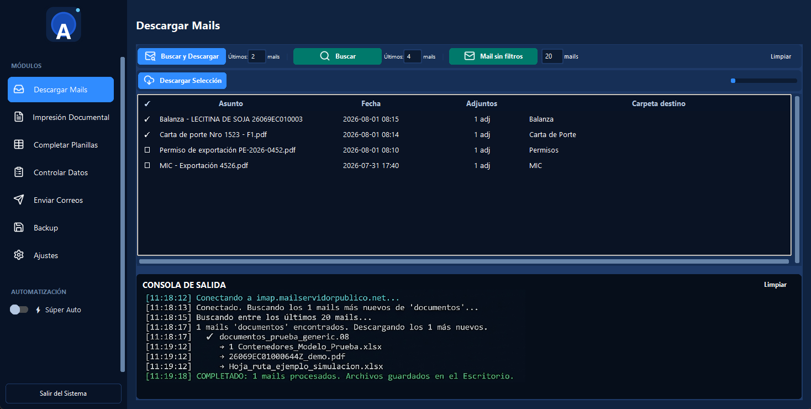 | 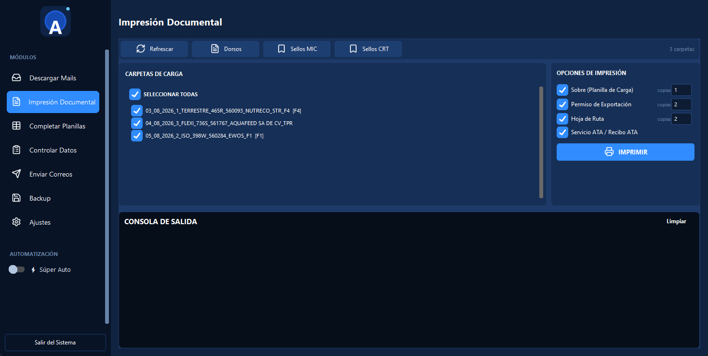 |

| Completar planillas | Control de datos |
| --- | --- |
| 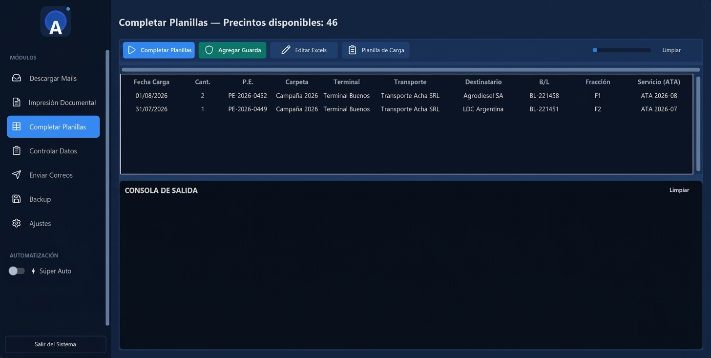 | 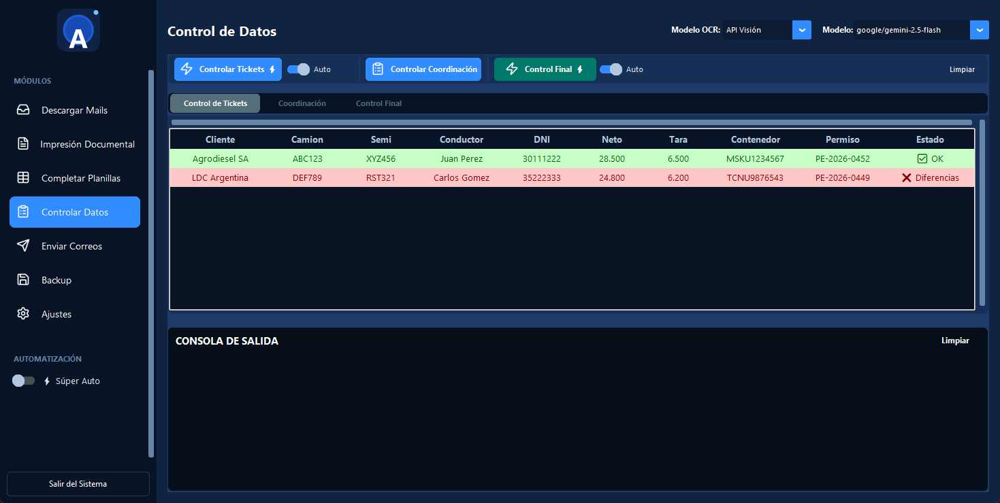 |

| Comparación tickets vs Excel | Comparación coordinación vs Excel |
| --- | --- |
| 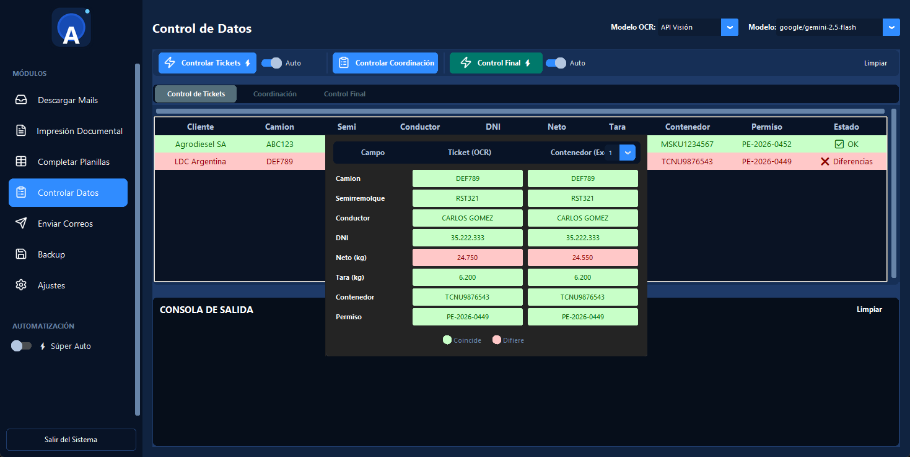 | 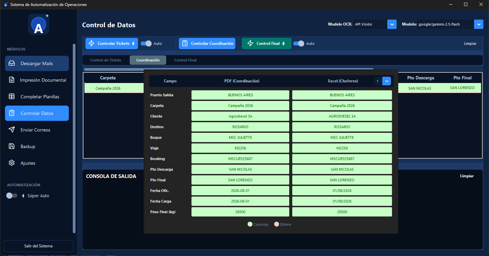 |

| Control final con MIC | Enviar correos |
| --- | --- |
| 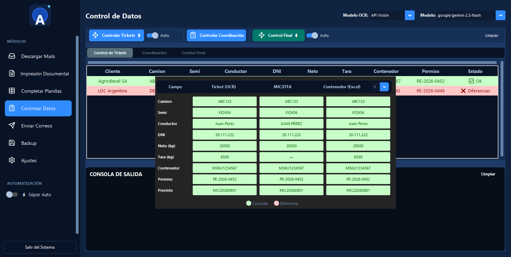 | 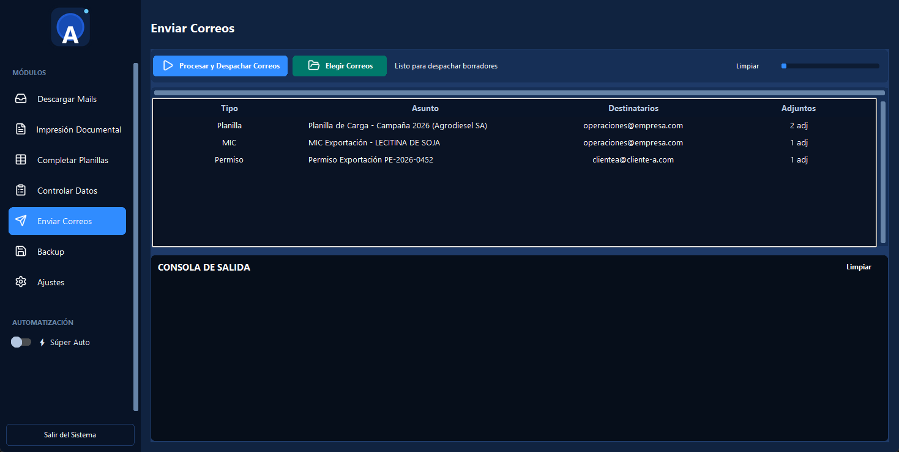 |

| Backup | Configuración |
| --- | --- |
| 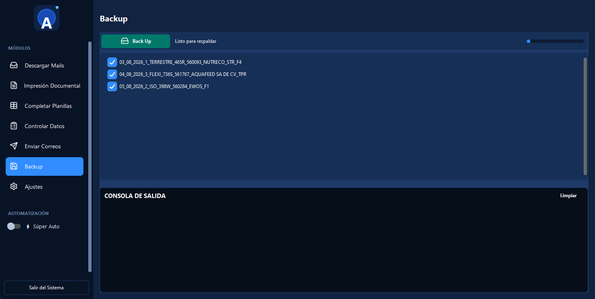 | 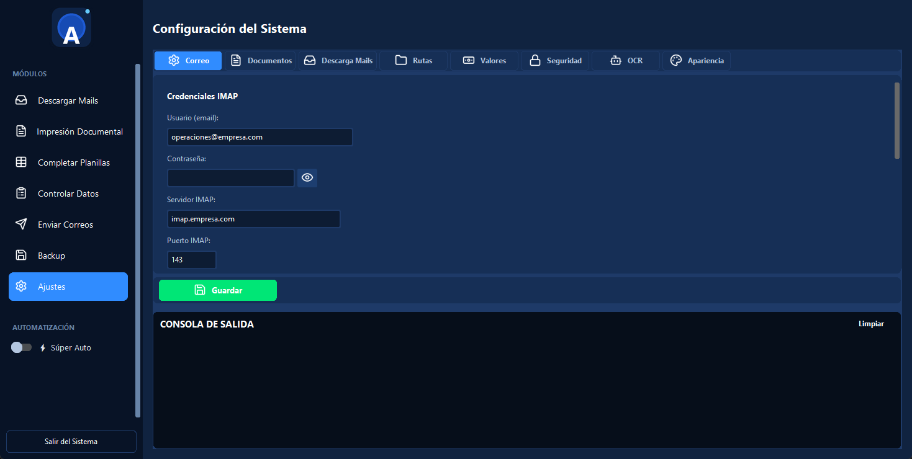 |

| Ajustes — OCR | Súper Auto |
| --- | --- |
| 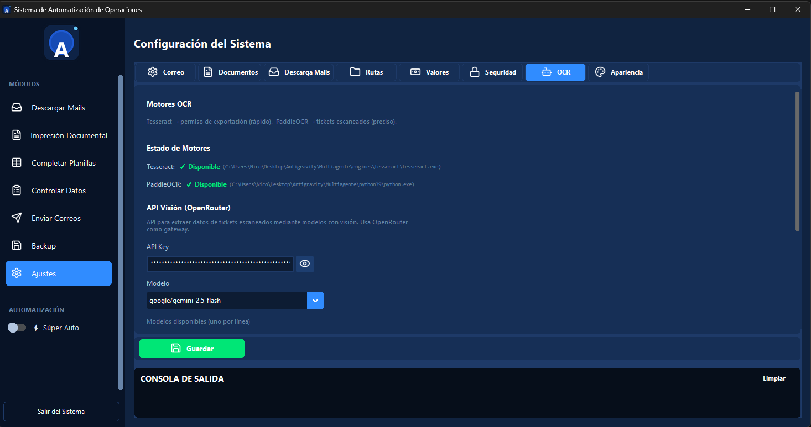 | 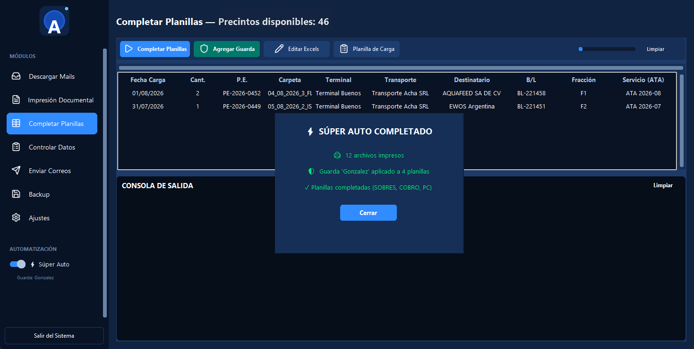 |

## Cómo funciona

La interfaz organiza el trabajo en paneles, cada uno con una tarea específica:

| Panel | Función |
| --- | --- |
| **Descargar Mails** | Consulta el servidor IMAP, filtra por remitente y descarga los adjuntos (tickets de balanza, cartas de porte, permisos, MIC). |
| **Impresión Documental** | Detecta las carpetas de carga en el escritorio (formato `DD_MM_YYYY_CANT_TIPO_PE_CARPETA_DEST`, ej. `04_08_2026_3_FLEXI_736S_561767_AQUAFEED SA DE CV_TPR`), imprime los dorso de cada documento (MIC, CRT, PE) y arma los sobres con los datos de la operación. |
| **Completar Planillas** | Escanea las carpetas de carga del escritorio, lee los `CONTENEDORES.xlsx` y completa las planillas del mes: **SOBRES** (fecha, cantidad de contenedores, permiso, carpeta, destino/cliente, transporte, buque, fracción y servicio ATA), **COBRO** (los mismos datos más el valor de cobro por carpeta) y **PC** (precintos de aduana con su permiso asignado, fecha, guarda y carpeta). Detecta operaciones compartidas entre dos permisos y las registra como pares. |
| **Controlar Datos** | Lee los tickets de pesaje con OCR y compara campo por campo contra la planilla (patente, semi, conductor, DNI, neto, tara, contenedor, permiso). También compara la coordinación del PDF contra el Excel de choferes y el control final contra los datos de aduana (MIC/DTA o salida). |
| **Enviar Correos** | Envía los correos con los archivos adjuntos correspondientes a los destinatarios configurados. |
| **Backup** | Respalda las carpetas de trabajo a un pendrive o a una ubicación alternativa. |
| **Ajustes** | Configura rutas, credenciales, destinatarios, modelo OCR y valores del sistema. |

Los controles de comparación marcan cada campo en **verde** cuando coincide y en **rojo** cuando difiere, para que la persona valide solo las diferencias reales.

## Arquitectura

El sistema trabaja con **agentes** independientes que se coordinan desde la interfaz:

1. **Agente de descarga** — conecta a IMAP, filtra remitentes y baja los adjuntos.
2. **Agente de impresión** — genera los dorso y los sobres documentales.
3. **Agente de control de datos** — extrae datos con OCR y los valida contra planillas y aduana.

### OCR con fallback paralelo

La lectura de los tickets de pesaje usa **dos motores de forma simultánea** y combina sus resultados para mayor precisión:

- **Local**: PaddleOCR (sin conexión, corre en la máquina).
- **API Visión**: modelos de visión por lenguaje (Gemini, Gemma, etc. vía OpenRouter).

Si un motor falla o devuelve un resultado dudoso, el otro cubre la lectura. El motor de API también se puede usar como *fallback* en paralelo con el local para los campos más difíciles. El estado y la configuración de cada motor se revisan en **Ajustes → OCR**.

### Súper Auto

El modo **Súper Auto** (interruptor en la barra lateral) encadena las tareas rutinarias de un solo paso: imprime la documentación de las carpetas seleccionadas, aplica el guarda de la operación a las planillas y completa las planillas (SOBRES, COBRO, PC). Al terminar muestra un resumen con lo realizado.

### Encriptación de credenciales

Las contraseñas y API keys se guardan en la configuración con prefijo `enc::`, encriptadas con una clave maestra (`MULTIAGENTE_SECRET_KEY`) derivada por PBKDF2. La clave vive en el `.env`, que no se versiona.

## Requisitos

- **Windows** (usa pywin32 para impresión y COM).
- Python 3.9+.
- Tesseract-OCR y Poppler (opcionales si se usa OCR local; el proyecto incluye el script `engines/setup_paddle.ps1` para instalar PaddleOCR).

## Instalación

```bash
# 1. Clonar el repositorio
git clone https://github.com/NBailone/multiagente-operaciones.git
cd multiagente-operaciones

# 2. Crear entorno virtual e instalar dependencias
python -m venv venv
venv\Scripts\activate
pip install -r requirements.txt
python -c "import customtkinter, openpyxl, xlrd, win32com; print('OK')"

# 3. Configurar la clave de encriptación
cp .env.example .env
# Generá una clave de 64 caracteres y pegalá en .env:
#   python -c "import secrets; print(secrets.token_hex(32))"

# 4. Ejecutar
python app.py
```

> En la primera ejecución la aplicación intenta instalar las dependencias de la interfaz automáticamente.

## Configuración

1. Generá la secret key y guardala en `.env` (ver arriba).
2. Desde **Ajustes** cargá las rutas de trabajo, credenciales de correo, destinatarios, plantillas de documentos y el método de OCR.
3. La configuración se persiste en `ui_config.json` (creado en la carpeta de la aplicación, no se versiona). Los datos sensibles se guardan encriptados.

## Empaquetar como .exe

```bash
pyinstaller Sistema_Automatizacion.spec
```

El ejecutable se genera en `dist/`. Incluir junto al `.exe` las carpetas `engines/` (OCR), `poppler/` (conversión PDF) y `python39/` (runtime).

## Estructura del proyecto

```
├── app.py                   # Interfaz principal (CustomTkinter), ventana y orquestación de agentes
├── panels/                  # Mixins de cada panel: impresión, planillas, descarga, correos, backup, control, ajustes
├── procesar_tickets.py     # Motor de OCR de tickets de pesaje y comparación de datos
├── constants/              # Paleta de colores, fuentes y valores por defecto
├── utils/                  # Utilidades (email, Excel, pendrive)
├── assets/
│   ├── icons/              # Iconos de la interfaz
│   └── screenshots/        # Capturas de la aplicación
├── engines/                # Binarios de OCR (PaddleOCR, Tesseract)
├── poppler/                # Herramientas de conversión PDF
├── openspec/               # Documentación de diseño (SDD)
├── requirements.txt        # Dependencias mínimas
├── .env.example            # Plantilla de variables de entorno
└── Sistema_Automatizacion.spec  # Script de PyInstaller
```

## Stack

- **Python 3.9+** · CustomTkinter · Tkinter (ttk)
- **OpenPyXL / xlrd** — lectura y escritura de planillas Excel
- **PaddleOCR / Tesseract** — reconocimiento óptico local
- **OpenRouter (Gemini, Gemma)** — visión por lenguaje como motor OCR alternativo
- **pywin32** — impresión y automatización COM en Windows
- **PyInstaller** — empaquetado del ejecutable
- **python-dotenv** — gestión de variables de entorno
